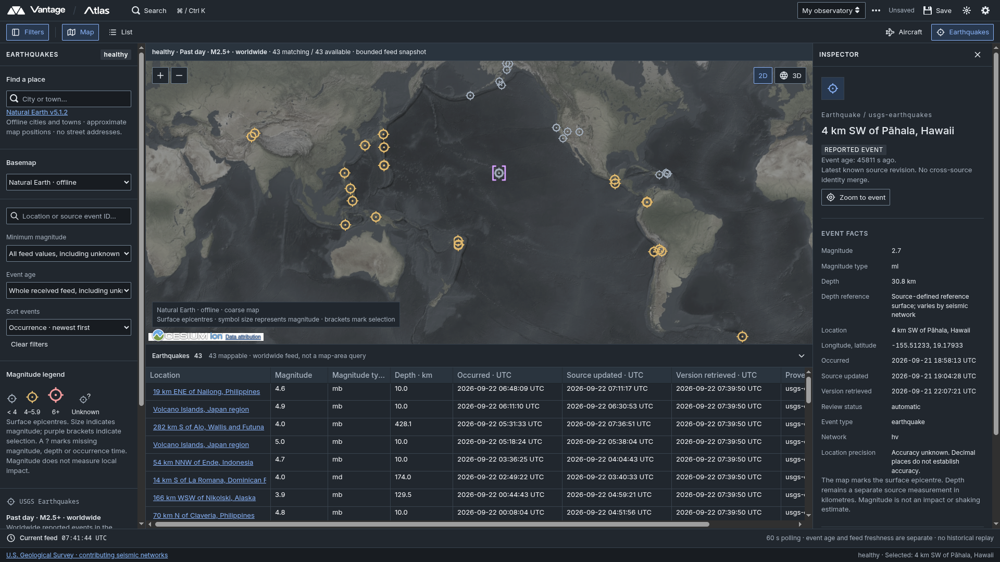

<picture>
  <source media="(prefers-color-scheme: dark)" srcset="logo/vantage%20logos/final/01-vantage-full-white-transparent.png">
  <source media="(prefers-color-scheme: light)" srcset="logo/vantage%20logos/final/02-vantage-full-black-transparent.png">
  
</picture>

VANTAGE is a free and open-source civilian intelligence environment for finding, inspecting, connecting and explaining publicly available information. It aims to make capabilities associated with platforms such as [Palantir Gotham](https://www.palantir.com/platforms/gotham/) accessible for open-source intelligence.

ATLAS is the first application in the ecosystem, providing shared map, globe, table, search and inspection workflows for exploring observations across place, time and source.

The wider framework is designed to grow into connected tools for relationships, timelines, investigations, monitoring, media analysis and cited reporting.

---

<p align="center">
  <picture>
    <source media="(prefers-color-scheme: dark)" srcset="logo/atlas%20logos/final/atlas-text-white-transparent.png">
    <source media="(prefers-color-scheme: light)" srcset="logo/atlas%20logos/final/atlas-text-black-transparent.png">
    
  </picture>
</p>

ATLAS now displays **live aircraft from ADSB.lol** and **earthquake events from the USGS past-day M2.5+ feed** together in one Cesium 2D map or globe, starting over Northern Europe. Map, table and inspector share observations stored in PostgreSQL/PostGIS. All live sources use capability adapters. The detailed basemap has an offline fallback, and **Find a place** searches a bundled city/town index. Each pane has one camera and time context with independent layer appearances, filters and selection. Workspace changes require **Save**; live feed updates do not mark the workspace unsaved.



The complete prototype remains governed by [PROTOTYPE_SPEC.md](PROTOTYPE_SPEC.md), [DESIGN.md](DESIGN.md) and the [approved decisions](docs/decisions/0002-blueprint-ui.md). [Stage 1](docs/stage-1.md), [Stage 2](docs/stage-2.md), the [adapter/map follow-up](docs/adapters-map-places.md) and the [aircraft source record](docs/sources/adsb-lol.md) document results and limitations. The [shared components / earthquake increment](docs/shared-components-earthquakes.md) and [USGS source record](docs/sources/usgs-earthquakes.md) cover the latest work.

## Current checkpoint — integrated foundation before connector breadth

Implementation-plan steps 1–3 added platform-owned aircraft/earthquake data, explicitly assigned workspace ownership and Keycloak authentication. Step 4 added authenticated Home, deliberate workspace launch, registered ATLAS and Settings navigation, and personal preferences. Step 5 added persisted aircraft/earthquake connections, datasets and revision-safe platform APIs. Step 6 added NEXUS — Data Manager. Step 7 composes aircraft and earthquake appearances in one ATLAS pane and migrates saved v1 state when read. Step 8 and its owner-approved follow-up add compact Layers/Sources navigation, full-area hierarchical List, independent Map/List panes and personal region/timezone settings. Step 9 adds a configurable bounded HTTP GeoJSON FeatureCollection connector through NEXUS, datasets and ATLAS groups. Step 10 checked their interaction, isolated independent GeoJSON feeds from one another's slow requests, and made a completed observation stream visible as an offline state while retaining its last snapshot. The initial operator is mapped by a stable internal ID plus provider issuer/subject before migration, never by the first account to sign in.

The application now requires a backend-managed OIDC session. Keycloak owns password and authenticator-app TOTP enrollment; VANTAGE enforces REST/live access, workspace ownership and CSRF protection. Sign-out, expiry and revoked access cancel affected live/background demand. The cancellation contract supports later recording; no recording interface is implemented here. See [identity operations](docs/identity-operations.md) for private operator enrollment, the loopback HTTP exception, session bounds and separate identity recovery.

NEXUS is available from Home and system navigation without a workspace. It lists connections and datasets, supports Add, Edit with explicit Save, Duplicate, Test/preview, Disable, Remove, and versioned JSON Import/Export. It shows local health, active demand and cached-data age separately; opening it does not start collection. In ATLAS, category/group eyes control Map and List visibility. A dormant group starts demand only when explicitly shown; after activation, hiding it retains its pane subscription for immediate re-show. **Sources** is a compact status list with right-click links to NEXUS; the plus button in **Layers** adds a group from one or more compatible datasets. The full-area List includes cached records without map locations; the List's group and record eyes affect map display only. If a live stream ends, ATLAS shows a source message, keeps the last received List/map snapshot and retries; use NEXUS to inspect a disabled or unavailable connection. Notes/clips and full recovery acceptance remain later work. [Implementation progress](docs/implementation-progress-2026-09-22.md) records actual checks, runtime state and limitations; these checkpoints do not establish full prototype acceptance.

The [change record](docs/atlas-workspace-change-record-2026-09-22.md) preserves decisions and scope; decisions [0006 — shell/composed ATLAS](docs/decisions/0006-vantage-shell-and-composed-atlas.md), [0007 — connections](docs/decisions/0007-configurable-connections.md) and [0008 — authentication](docs/decisions/0008-authentication-and-session-lifecycle.md) define the implementation boundaries. The [specification](PROTOTYPE_SPEC.md) contains the revised sequence and AC-01–21 completion gate.

## Prerequisites and pins

Run commands from the repository root. This Fedora laptop already has the prerequisites; no system installation is needed.

| Tool | Pin / location |
| --- | --- |
| Node / npm | 24.20.0 / 11.19.0; `mise.toml`, `frontend/package.json` |
| Local .NET SDK | 10.0.111; `global.json` |
| EF CLI / NSwag | 10.0.11 / 14.7.1; `.config/dotnet-tools.json` |
| JavaScript / NuGet packages | Exact direct versions and committed lockfiles |
| PostgreSQL / PostGIS | 18 / 3.6 image pinned by digest in `infra/compose.yaml` |
| Keycloak | 26.7.4, pinned by digest in `infra/compose.yaml` |
| Python | Python 3 for local backup and isolated verification scripts |
| Browser tests | Playwright 1.63.0 and matching Ubuntu Noble container, pinned by digest |
| Container .NET SDK / runtime | 10.0.401 / 10.0.11, pinned by digest; `infra/global.json` |

The SDK container uses a separate explicit pin because Microsoft's registry did not provide a `10.0.111` SDK image. Both builds target .NET 10; the container does not change the installed SDK. Docker Engine and Compose are required. Commands below use `sudo` because this laptop's Docker socket requires it.

```sh
node --version
npm --version
dotnet --version
sudo docker version
sudo docker compose version
```

## Start locally

Activate the pinned Node/npm environment with mise if it is not already active. Generate protected local configuration, restore dependencies, and start PostgreSQL plus Keycloak:

```sh
node scripts/init-local.mjs
npm --prefix frontend ci
dotnet tool restore
dotnet restore Vantage.slnx --locked-mode
sudo docker compose --env-file infra/.env -f infra/compose.yaml up -d --wait keycloak
```

For an existing installation, follow the backup and isolated migration checks below before changing its database. Stop any native API during backup/migration. Apply migrations with the administrator connection, then provision the restricted application role:

```sh
ASPNETCORE_ENVIRONMENT=Development dotnet run --project backend/Vantage.Api --no-launch-profile -- --migrate
sudo docker compose --env-file infra/.env -f infra/compose.yaml --profile container run --rm --no-deps app-db-init
```

In separate terminals:

```sh
ASPNETCORE_ENVIRONMENT=Development Identity__PublicOrigin=http://127.0.0.1:5173 dotnet run --project backend/Vantage.Api --no-launch-profile -- --urls http://127.0.0.1:5080
```

```sh
npm --prefix frontend run dev
```

Open [http://127.0.0.1:5173](http://127.0.0.1:5173) and sign in. Follow [private operator enrollment](docs/identity-operations.md#initial-operator-enrollment) on a new installation. Vite proxies `/api`, `/hubs`, `/auth`, `/signin-oidc` and `/signout-callback-oidc` to port 5080. Keycloak uses `localhost:8180`; PostgreSQL uses loopback port 54329. Use the documented application hostname and port: the provider permits exact callbacks.

After authentication, VANTAGE opens Home. NEXUS manages connections without a workspace; Settings also opens without one. Choose an existing workspace or create one before opening ATLAS. Settings saves the personal theme, display timezone and default map region immediately; the region centres **new** workspaces and does not move existing saved cameras. New workspaces begin with a visible aircraft group and a dormant earthquake group. Existing v1 workspaces are converted on read using the previously active view's camera and participation; stored JSON remains v1 until Save, and inactive-view settings remain available in the group editor's **Previous view** tab.

In ATLAS, compact **Layers** rows show category and group visibility. The plus button adds a group. Right click a group or press Shift+F10 for **Filters**, **Actions**, **Settings** or confirmed **Delete group**; each dialog uses Save/Discard. Settings selects compatible datasets and configures appearance and coverage; Filters and Actions have their own dialogs. Groups can be changed without changing NEXUS connections or retained observations. The **Sources** tab is a compact name/status list; right click a source or press Shift+F10 for **Configure in NEXUS**. **Map** and **List** are independent toggles and can be resized side by side. List is a foldable category → group → record hierarchy for all visible groups across the full queried area, including records without map locations. Its group eye hides or shows all group records on the map; after hiding all, individual record eyes can show selected records. Layer/category eyes hide Map and List content together without reloading the map; active hidden groups retain their live snapshot for immediate re-show until the pane closes or group is removed. This uses provider and network capacity while hidden; equivalent requests share demand, and NEXUS connections and other panes remain independent. Narrow splits show an outliner row and map eye, with details in the inspector; wide List mode shows the semantic record table. The map's square tool button contains place search and the aircraft area action after selecting an aircraft record; **Terrain** opens a compact basemap menu below **2D / 3D**. The bottom **Timeline** opens an explicit unavailable placeholder. Source warnings and failures appear in the toolbar inbox.

**Duplicate pane** creates an unlinked copy. **Save** or **Ctrl/Cmd+S** persists workspace changes; Ctrl/Cmd+K opens search. Filter, panel, selection, visibility and camera changes mark the workspace unsaved. Personal display preferences save separately from workspace state. Returning Home retains an unsaved draft until another workspace is opened or the session ends. **Sign out** ends the session and clears current client state; previously saved work remains stored.

## Run the built application in containers

Stop the native API first if it occupies port 5080. Complete the backup/isolated migration checks before upgrading an existing database. This builds the frontend into ASP.NET's `wwwroot`, runs a separate migration job and runtime-role provisioning, waits for Keycloak, then starts one origin for UI and API:

```sh
node scripts/init-local.mjs
sudo docker compose --env-file infra/.env -f infra/compose.yaml --profile container up -d --build app
```

Open [http://127.0.0.1:5080](http://127.0.0.1:5080) and sign in. [Health](http://127.0.0.1:5080/api/v1/health) reports `ready` after storage is available. The application runs as the image's non-root user and the restricted `vantage_app` database role. Only migration/provisioning jobs receive the database administrator connection. An app restart invalidates existing backend sessions and requires sign-in again.

For an app-only restart and read-only service check on the existing installation:

```sh
sudo docker compose --env-file infra/.env -f infra/compose.yaml --profile container restart app
sudo docker compose --env-file infra/.env -f infra/compose.yaml --profile container ps
curl -fsS http://127.0.0.1:5080/api/v1/health
```

At the step-10 checkpoint, the app-only restart reported application/storage `ready`; PostgreSQL and Keycloak remained healthy. Read-only fingerprints of the workspace, three connections, three datasets, identity mapping and the operator's existing 49 GeoJSON observation/delivery rows matched before and after rebuild/restart. No new EF migration was needed. The step-9 protected backup was restored and migrated again in an isolated PostgreSQL/PostGIS database; every backed-up original row and field matched. Exact evidence and the current limitations are in [implementation progress](docs/implementation-progress-2026-09-22.md#10-integrated-checkpoint-before-connector-breadth--review-checkpoint).

```sh
sudo docker compose --env-file infra/.env -f infra/compose.yaml --profile container stop app
```

The named `vantage_database` volume retains both application data and the separate Keycloak database across stops and container recreation. Do not remove it or recreate either database to fix startup problems.

## Contracts and migrations

REST DTOs live in `backend/Vantage.Api/Contracts`. Versioned record, connector-settings, template and portable-definition JSON Schemas live in `contracts/schemas/v1/`; bundled starting templates live in `contracts/templates/v1/`. Workspace state is validated on both sides; revision checks reject stale saves. Unsupported stored state is preserved and reported as an error.

Authenticated `/api/v1/connections` exposes connector types, schemas, templates, connection list/create/edit/duplicate/remove, datasets, affected-workspace impact, read-only local status, explicit saved-connection test or unsaved-draft preview, and secret-free JSON import/export. Mutation routes require the session CSRF token. The backend validates settings and owner/workspace scope before a revision becomes active; a failed edit leaves the working revision intact. Status reads current local demand and cache facts without requesting the provider. Test/preview makes a bounded provider request but saves no observations. Removal keeps connection/dataset references and retained evidence. Deleting a workspace cancels its scoped demand and revokes its scoped data/evidence access while retaining connection records for recovery. Aircraft, earthquake and GeoJSON REST routes and `AircraftConnection`, `EarthquakeConnection` and `GeoJsonConnection` hub streams use authorized connection IDs. Availability or import alone does not start collection.

After REST changes, regenerate both OpenAPI and the TypeScript client; the API need not be running:

```sh
npm --prefix frontend run api:generate
```

Commit the generated `contracts/openapi/v1.json` and `frontend/src/api/generated/client.ts` together. Do not hand-edit the client. The running API also serves `/api/openapi/v1.json`.

Before applying a database change to existing work, stop any native API and create a protected application backup. The script stops the Compose application and leaves it stopped:

```sh
python3 scripts/backup-local.py
```

Set `migration_backup` to the protected directory printed by that command. Create/review the EF migration, then restore that backup into an isolated PostgreSQL/PostGIS database and verify preservation before applying it to the operator's database:

```sh
migration_backup='artifacts/private-backups/<printed-timestamp>'
dotnet ef migrations add YourChangeName --project backend/Vantage.Api --output-dir Persistence/Migrations
python3 scripts/verify-backup-migration.py "$migration_backup"
ASPNETCORE_ENVIRONMENT=Development dotnet run --project backend/Vantage.Api --no-launch-profile -- --migrate
sudo docker compose --env-file infra/.env -f infra/compose.yaml --profile container run --rm --no-deps app-db-init
```

The isolated drill restores with `pg_restore`, applies migrations, compares original table contents and drops only its randomly named verification database. The protected backup contains `vantage.dump`, schema and content/hash checks; it excludes Keycloak credentials, encrypted connection-secret table data and local secret configuration. Connection definitions and unresolved credential references remain in the application backup, so restored credential-dependent connections show setup-required until separately reprovisioned. The connection encryption key is held in ignored mode-0600 configuration; preserve it only in a separate protected secret-recovery set. See [implementation progress](docs/implementation-progress-2026-09-22.md) for preservation evidence and [identity operations](docs/identity-operations.md#protected-identity-backup) for separate identity recovery. Keep backups private and preserve stable owner/issuer/subject mappings when restoring.

Normal API startup uses `ConnectionStrings:VantageRuntime` and does not migrate. Explicit `--migrate` uses the administrator `ConnectionStrings:Vantage`; Compose orders its separate migration/provisioning jobs automatically. The ownership migration moves current aircraft, earthquake and feed tables into `platform`, preserving IDs/provenance and assigning legacy work to the configured initial operator. The step-5 migration captures existing provider enabled/cadence values once as two connection rows, links existing projections and observation deliveries without changing source or observation IDs, and never reseeds edited or removed defaults. ATLAS state v2 changes workspace JSON only; no EF schema migration is needed for that conversion. `20260923140926_DisplayRegionAndTimeZone` adds personal default-region/timezone columns. `20260923171048_GeoJsonFeatures` additively creates current GeoJSON/PostGIS and feed-status tables; it does not alter original rows. Back up and verify each migration in an isolated PostGIS database before applying it to an existing installation. A valid v1 workspace is converted on read and persisted as v2 only when explicitly saved. Invalid stored originals remain in the database, with a recovery error instead of an automatic rewrite.

The authenticated `/hubs/observations` hub streams separate versioned `AircraftBatch`, `EarthquakeBatch` and `GeoJsonBatch` contracts. Earthquake revisions remain ordered by source-update time, independently of occurrence and retrieval; GeoJSON revisions follow the source feature identity and changed content. Retention remains isolated by data type/source. Reconnect uses a reset snapshot because the sources have no durable resume history. Schema validation and sequence checks run before frontend cache mutation.

Independent GeoJSON connections can refresh concurrently, with at most four GeoJSON fetches active at once; equivalent layer appearances still share their one connection demand. A slow or malformed feed cannot hold up another configured GeoJSON connection. When the server completes a stream after a connection change, the client retains its last received snapshot, reports the interruption and retries after a bounded delay. This does not make old data current or restart dormant migrated layers.

## Checks

```sh
dotnet build Vantage.slnx --no-restore
node scripts/test-backend.mjs
npm --prefix frontend run lint
npm --prefix frontend run typecheck
npm --prefix frontend run test
npm --prefix frontend run build
```

The backend check creates and drops its own randomly named database on the local PostgreSQL server and applies real PostGIS migrations. It covers ownership, platform access without ATLAS, workspace revisions, personal preference migration/API behaviour, connection lifecycle/scope/validation/import/export, GeoJSON parsing/bounds/security, last-valid-result persistence and restart, shared demand, spatial queries, domain revisions, source substitution, cancellation and retention isolation. It uses the ignored administrator connection, or `VANTAGE_TEST_CONNECTION` when supplied. Plain `dotnet test` skips database scenarios without that environment variable. Frontend tests cover registration/import boundaries, session/CSRF handling, cancelled or late responses, cache cleanup, workspace ownership, preference separation, domain ordering and marker behaviour, including generic geometry and unknown-location records. Check results belong in [implementation progress](docs/implementation-progress-2026-09-22.md); fixture checks alone do not verify Keycloak.

On Fedora, with the built app already running at `http://127.0.0.1:5080`, run the fixture-only Home, NEXUS, composed ATLAS and GeoJSON browser checks in the matching Playwright container. They intercept session, workspace, connection, preference and health requests, and use no Keycloak administrator, application database or live connector:

```sh
sudo docker compose --env-file infra/.env -f infra/compose.yaml --profile test build browser
sudo docker run --rm --network host --ipc=host \
  -e PLAYWRIGHT_BASE_URL=http://127.0.0.1:5080 \
  vantage-browser npm run test:browser -- tests/browser/home-fixture.spec.ts tests/browser/nexus-fixture.spec.ts tests/browser/atlas-fixture.spec.ts tests/browser/geojson-fixture.spec.ts
```

The browser fixtures also cover canceling sign-out with an unsaved draft, completing a delayed logout response, NEXUS draft/validation/stale-revision/navigation workflows, and compact ATLAS group/list/map workflows with fixture Save/reload, keyboard access, both themes and narrow layout. The ATLAS fixture includes a rate-limited source and two configured aircraft sources in one group. The GeoJSON fixture configures/previews two connections in NEXUS, adds both datasets beside aircraft and earthquakes, shows null geometry in List, copies a group without doubling upstream demand, checks the stable Cesium canvas and instant re-show, and saves/reopens its fixture workspace. These checks do not make live provider requests.

This browser check does not verify real provider sign-in, persistent API writes or live source data. The older `frontend/scripts/test-auth-live.mjs` and authenticated browser setup still use the retired bootstrap administrator, so the earlier live-authentication command sequence is no longer usable. Do not put recovery-administrator credentials in test files. The owner's real password/TOTP and recovery handoff is recorded separately in [implementation progress](docs/implementation-progress-2026-09-22.md); a complete clean-install recovery exercise remains outstanding. Authenticated browser traces remain disabled because they can contain session cookies.

## Layout and configuration

- `frontend/src/platform`: app/system-tool registration, session gate and guarded transport, context bus, owned workspace service, shared observation channels/cache, maps, results/inspectors, shell and theme.
- `frontend/src/apps/atlas`: the registered app, aircraft/earthquake and generic GeoJSON presentation.
- `backend/Vantage.Api`: platform identity/access, connection/dataset and observation services/endpoints, ATLAS workspace template, EF persistence and replaceable `Connectors/AdsbLol`, `Connectors/Usgs` and `Connectors/GeoJson` in a modular monolith.
- `contracts`: versioned schemas, OpenAPI and NSwag configuration. `tests/` and `frontend/tests/` hold the small verification harnesses.
- `infra`: Compose, image definitions and the Keycloak realm template. `scripts`: protected local provisioning, backup/migration verification, client generation and test setup.

`init-local.mjs` preserves existing values and adds missing database/identity/connection-key configuration to ignored mode-0600 local files. It also preserves protected one-time Keycloak bootstrap/import files and explicit initial-owner IDs. [Identity operations](docs/identity-operations.md) lists the files, permissions and recovery boundaries. Environment variables override application settings. Keep credentials out of `VITE_*` variables: those enter the browser bundle. Changing a password file alone does not rotate an existing database/provider credential. Changing a host or port also requires matching provider callbacks and identity configuration.

Host ports remain on loopback. The reference HTTP exception is limited to that local deployment; remote exposure requires a separately configured HTTPS issuer/origin, Secure cookies and exact callback URLs. OIDC access/refresh tokens stay in backend memory, while the browser uses an HttpOnly session cookie. The fixed session lasts up to 30 minutes; backend validation has a documented 25-second cleanup bound. Provider failure never enables anonymous access.

Blueprint uses `PopoverNext` and the supported overlay path, with one theme adapter applied to the body so portals inherit the active theme. Normal `npm ci` succeeds without force/legacy-peer flags. An upstream, unused legacy `react-popper@2.3.0` dependency still reports React 19 as outside its peer range in `npm ls`; keep the restriction on deprecated `Popover`/`Overlay` components. The date control receives a bundled locale explicitly to avoid Blueprint's Webpack-specific dynamic locale loader.

Cesium assets are prepared automatically by `predev` / `prebuild` from the pinned package. The coarse Natural Earth basemap requires no network service or key. **OpenStreetMap** supplies detailed online tiles through a separate adapter. The selector offers the offline map explicitly; a tile/network failure falls back to it with a visible message and manual retry. See [the basemap decision](docs/decisions/0004-cesium-basemap.md) and [DS-01 source record](docs/sources/basemap-places.md).

Aircraft services consume `IAircraftSource` through the registered connector type. The adapter supplies source name, query limits and coverage; the persisted connection supplies enabled state and polling cadence. Storage and UI remain provider-independent; cached data retains its original source.

ADSB.lol collects only while an authorized aircraft consumer is open. The former `Sources__AdsbLol__Enabled` / `PollSeconds` settings and Compose equivalents are read only for the one-time migration; subsequent availability edits belong to persisted connection revisions. The migrated cadence is retained; new connections use the bounded 30-second default. Ordinary connection edits cannot override polling cadence. Changing legacy environment values after migration does not override saved rows. No provider credential is needed. Cache budgets and retention are documented in the source record.

Basemap and place capability contracts live in `frontend/src/platform/maps` and `platform/places`; adapters and their registration live in `frontend/src/connectors`. Changing the registered provider does not change the ATLAS view. Every future source follows the same capability-boundary rule.

**Find a place** searches 7,342 bundled Natural Earth cities/towns, including supplied aliases and accent-insensitive matching. It makes no geocoding request. Positions are approximate map labels, not addresses or verified current observations. Selecting a place moves the camera; **Search this area** explicitly moves the aircraft collection. Save retains the camera and chosen basemap. Global Ctrl/Cmd+K searches saved workspaces; use each domain’s filters for live records.

The place index is checked into `frontend/public/data/`; ordinary builds work without downloading it. To reproduce it from the checksum-pinned upstream release (or supply a previously downloaded source file as the final argument):

```sh
node frontend/scripts/prepare-places.mjs
```

Production builds emit `third-party-licenses.txt` with bundled dependency notices, including Blueprint, React, Inter and Tabler Icons. Original repository marks are reused; design reference screenshots are not shipped.

## Earthquakes

In **Layers**, show the earthquake group with its eye to request the configured current feed and include it in Map and List. The source supplies a worldwide past-day M2.5+ feed; it does not promise complete global detection. Northern Europe is the initial map region unless a different personal default is chosen for a new workspace. Use List and **Zoom to event** to inspect distant events. Right click the group and choose **Filters** to filter by location/event ID, magnitude or event age and sort by occurrence, magnitude or source update. The hover/focus legend explains marker size; selection adds brackets. The inspector exposes depth in km, magnitude type, source times and provenance.

Save preserves the shared pane camera, independent layer filters, selection, basemap and panels. Feed updates do not mark the workspace dirty. Occurrence drives event age; feed generation drives freshness. A stale/unavailable feed retains its last successful snapshot with a visible status. Unknown fields remain unknown; depth is never passed as Cesium altitude.

Earthquake collection requires no key. The former `Sources__Usgs__Enabled` / `PollSeconds` settings and Compose equivalents are read only for the one-time migration; persisted revisions control availability while preserving the migrated cadence. New connections use the bounded 60-second default; ordinary edits cannot override it. The endpoint is fixed inside the adapter. REST exposes cached `/api/v1/earthquakes`, source metadata and typed immutable observation reads; SignalR demand starts shared collection. No open view means no upstream polling.

## Configurable HTTP GeoJSON

In NEXUS, choose **Add** → **HTTP GeoJSON FeatureCollection**. Supply a public HTTPS FeatureCollection URL, a stable source ID and name, attribution, the source's terms URL and a coverage description. Set a direct property key for the label; leave the identity field blank to use each Feature's `id`, or name a property containing a stable unique string or integer ID. Optional direct property keys map source time and validity bounds **only when the source publishes ISO-8601 timestamps with an explicit offset**. A numeric epoch value is not silently converted. Select no authentication or a backend-held bearer credential. Use **Test / preview** to request and inspect a bounded sample without saving observations, then **Save connection**. Saving or restoring a connection alone starts no polling. Check the publisher's current terms, update cadence, attribution and format before configuring a real endpoint.

Open an ATLAS workspace. Use the **Layers** plus button to add a group and select one or more GeoJSON datasets; the **Sources** tab only shows status and the right-click link back to NEXUS. The group joins aircraft and earthquake groups in Map and List. Point/MultiPoint features appear as symbols; LineString/MultiLineString and Polygon/MultiPolygon features are drawn on the map, with source properties and provenance in the inspector. A Feature with `geometry: null` remains a keyboard-accessible List/inspector record marked off map. Copying or adding another presentation of the same dataset shares its active collection. A migrated dormant appearance does not start collection until the owner explicitly shows it. Once active, hiding/showing a group retains that pane's snapshot for immediate re-show without recreating Cesium; closing the pane or removing the group releases its demand.

The connector fixes polling at 120 seconds and caps a decoded response at 1 MiB, 500 features, 50,000 coordinates total, 5,000 per feature and 16 KiB of properties per feature. Requests have a 15-second timeout, use public HTTPS port 443 only, reject query/fragment/userinfo, redirects and private/reserved DNS destinations, and do not use a proxy. Only declared WGS84 Point/MultiPoint, LineString/MultiLineString and Polygon/MultiPolygon are accepted; alternate CRS, unsupported/invalid geometry, malformed JSON, missing/duplicate IDs and invalid mapped times fail the whole refresh with a visible error. A bad response retains the last valid snapshot. Source IDs, feature IDs, attribution, retrieval time, mapped source time, properties and content revisions remain in stored evidence. A third coordinate is retained as source data without assuming an altitude reference. Missing values stay unknown; snapshot omission does not prove a feature ended. Current projections use PostGIS, and retained GeoJSON evidence is bounded to 48 hours/50,000 records. Credentials stay on the backend; portable connection JSON carries only a setup-required marker. Changing the endpoint or authentication mode clears the saved credential.

Authenticated `/api/v1/geojson` provides a cached snapshot, source metadata and bounded evidence reads; `GeoJsonConnection` streams versioned batches on demand. The settings schema and template are in `contracts/schemas/v1/http-geojson-settings.schema.json` and `contracts/templates/v1/http-geojson.json`. [Decision 0007](docs/decisions/0007-configurable-connections.md) sets the interpretation boundary; [implementation progress](docs/implementation-progress-2026-09-22.md) separates fixture checks from the limited real-feed smoke check. Imagery, recording/replay, media and annotations remain later work. The complete prototype acceptance gate remains outstanding; these checks do not certify full performance or accessibility compliance.

## Map and panel controls

See the [UI refinement record](docs/ui-refinement.md) for marker rules, migration behaviour and verification.

**Map** and **List** are independent toggles and can remain open together. Resize their separator by dragging or with arrow keys; the sidebar and inspector edges also support drag/keyboard resize. List is a compact category → group → record hierarchy over the full queried area. At wide widths its semantic table shows source, summary and relevant time; narrow splits retain a one-line record and map eye, with full facts in the inspector. Click an overlapping map marker to choose its group appearance. The map's **2D / 3D** buttons have an aligned **Terrain** menu button beneath them, and the square Tools button holds place search and the aircraft area action after selecting an aircraft record. The toolbar bell holds source warnings. The bottom bar expands only an unavailable Timeline placeholder. Widths, group/record map visibility, selected records and camera persist with workspace Save. Stored source times remain UTC; Settings chooses their display timezone.

Aircraft are plane symbols: red for reported grounded, yellow for old/unknown-age positions, blue for recent positions. Ground state takes precedence. Purple brackets identify selection. A small superscript **?** flags missing track/heading, ground state or position time; earthquake badges flag missing magnitude, depth or occurrence time. Legends explain the rules and inspector/table fields retain explicit unknowns. Globe occlusion applies to symbols, badges and brackets. The retired demo collection and demo search provider are removed.
